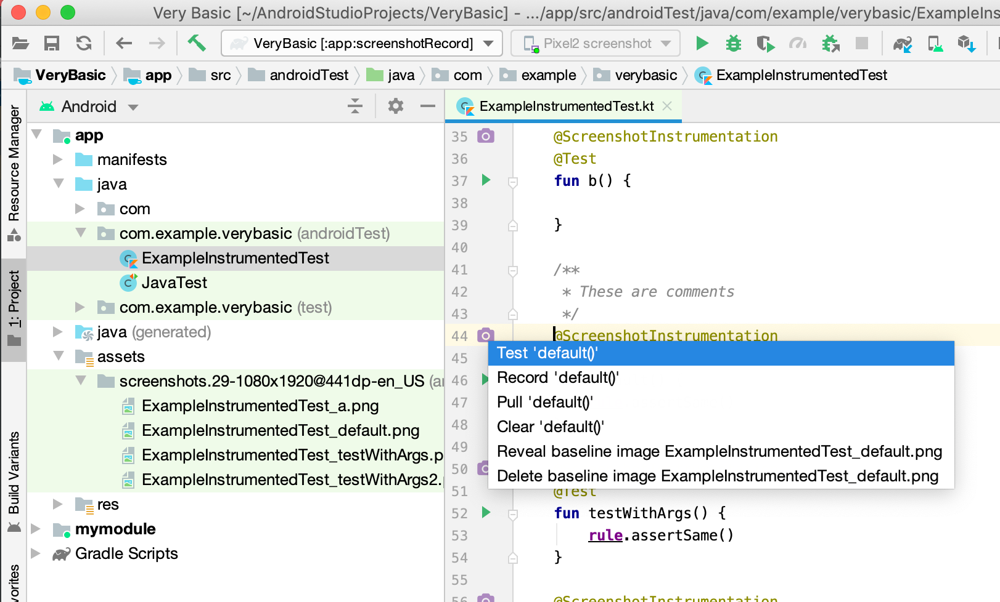

# Android Testify - IntelliJ Platform Plugin

<!-- Plugin description -->
Testify screenshot tests are built on top of Android Instrumentation tests and so already integrate seamlessly with existing test suites. Screenshots can be captured directly from within Android Studio or using the Gradle command-line tools.

However, the current Android Studio support relies fully on the fact that Testify tests extend ActivityTestRule and can be invoked using the built-in support for running instrumentation tests with various commands (notably sidebar icons) in Android Studio. These are limited to run and debug commands. Android Studio has no concept of recording or pulling screenshots from the device. Thus, it requires developers to drop to the Gradle Panel or command-line to fully use Testify. This project will enhance the developer experience by adding fully integrated IDE UI for all relevant Testify commands.
<!-- Plugin description end -->

---

### Changes

[Change log](CHANGELOG.md)

### Contributing

[Building and Running the plugin](CONTRIBUTING.md)

### Citations

[Code used in this project](CITATIONS.md)

### License

[MIT License Copyright (c) 2022 ndtp](LICENSE)