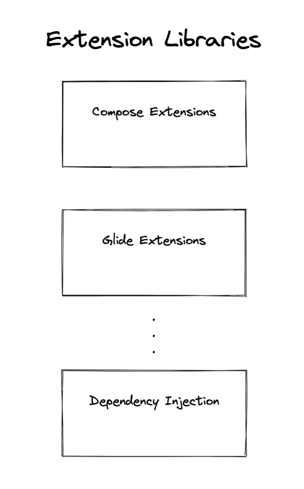

# Extensions

It should be easy and convenient to use Testify with most Android projects. We should anticipate the usage of common design patterns and popular libraries and ensure that Testify works well with them.

Integrating Testify into an Android project should be straightforward. The core Testify library is designed to work with a new project created using a template from the most recent stable release of Android Studio. For more complex integrations, Testify will provide a set of modular extension libraries that can be used to reduce boilerplate and deliver a set of prebuilt solutions to common problems.

Testify should be complementary to existing, commonly used libraries and patterns such as:

- Application or Library projects
- Jetpack Compose UI
- Single Activity, MVVM, MVP and MVC architectures
- Espresso UI Testing
- Image loading libraries like Picasso, Glide and Coil
- Dependency injection systems like Dagger, Koin or Hilt.

---

