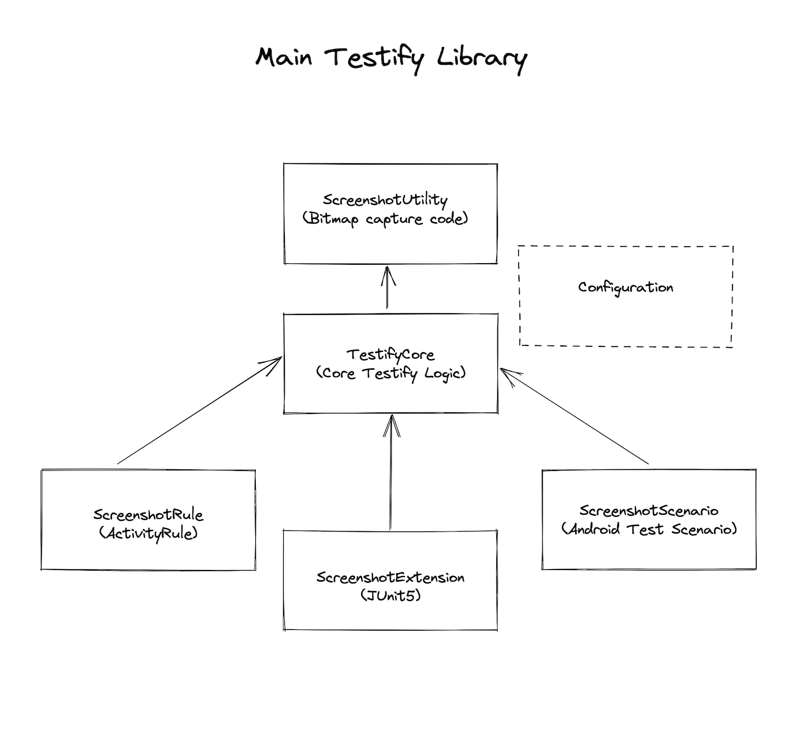

## Overview

Testify should provide a comprehensive set of testing methods and classes. The priority is on capturing authentic, “real world” renderings of any valid Android UI. This means supporting classic Android Views, Compose UI and Surface Views (such as Maps and WebViews). 

There are a variety of testing libraries commonly used for Android testing and Testify should integrate seamlessly with as many as possible. 

In order to enable these integrations, Testify should be highly modular and offer a scalable, programmable and extensible API set. 

🥇 **The core goal of Testify 2.0 is to provide a highly customizable and configurable core library with many pre-built solutions for common testing scenarios.**

## Library Architecture

#### ScreenshotUtility

Encapsulates code required for capturing, saving and processing bitmaps.

#### TestifyCore

Base extensible module which orchestrates the Testify lifecycle and acts as the main hub for the core logic controlling how & when Testify can capture and compare screenshots.

This will be achieved with a series of interfaces that expose the configuration and lifecycle methods. Subclasses of TestifyCore will expose functionality via API patterns familiar to various testing libraries.

#### ScreenshotRule

An [ActivityTestRule](https://developer.android.com/reference/androidx/test/rule/ActivityTestRule) implementation that provides JUnit4 Instrumentation test support.  This is existing 1.* Testify API and will be maintained for backward compatibility.

#### ScreenshotExtension

The ScreenshotExtension library will provide a [JUnit Jupiter (JUnit5) extension model](https://junit.org/junit5/docs/current/user-guide/#extensions) implementation for writing JUnit5-style tests.

#### ScreenshotScenario

Provides an [ActivityScenario](https://developer.android.com/reference/androidx/test/core/app/ActivityScenario) implementation for Android Instrumentation testing. This replaces the deprecated ActivityTestRule provided by Testify 1.*.

---
