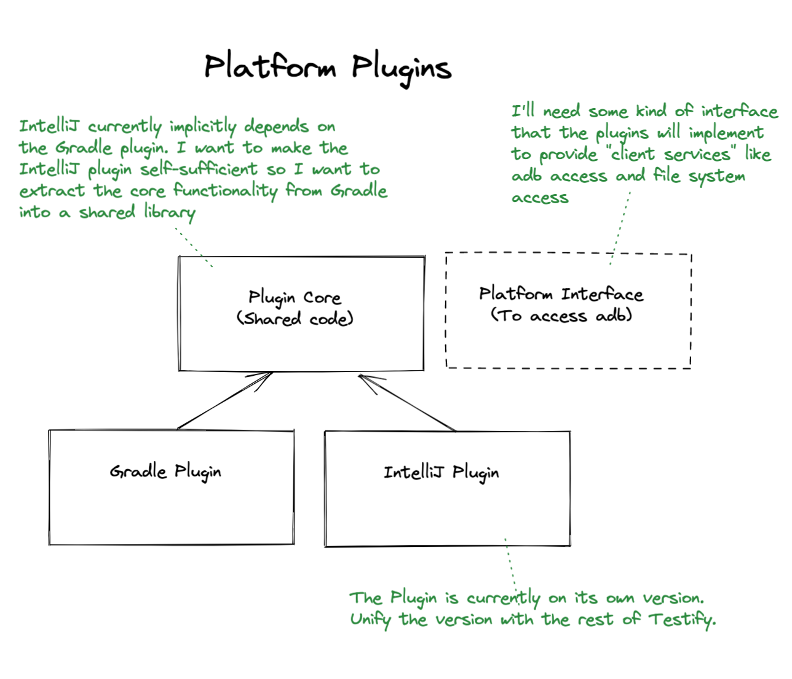

# Plugins

Plugins are provided to improve the client-side development experience. Plugins offer shortcuts to commonly used functionality. For example, recording baseline images, running tests, and generating reports.

In Testify 1.*, the Gradle and IntelliJ plugins had separate codebases and were versioned independently. In addition, the IntelliJ plugin implicitly required the configuration and use of the Gradle plugin. The IntelliJ plugin provided only a menu/GUI for the underlying Gradle commands.

In Testify 2.0, the plugins will share a common codebase and be aligned with the overall Testify releases and versions. In order to accomplish this, a new shared code module will be created. This will allow the IntelliJ plugin to provide Testify functionality directly, without relying on the presence of the Gradle plugin.

### Gradle Plugin

The [Gradle plugin](https://docs.gradle.org/current/userguide/custom_plugins.html) provides a set of [_tasks_](https://docs.gradle.org/current/userguide/tutorial_using_tasks.html#sec:projects_and_tasks) which can be used to record and copy baseline images, run tests, view diagnostics and generate reports using the `gradle` command-line interface.

### IntelliJ Platform (Android Studio) Plugin

The IntelliJ plugin provides an integration into the [IntelliJ platform](https://plugins.jetbrains.com/docs/intellij/welcome.html).

The IntelliJ plugin is published to the [JetBrains Marketplace](https://plugins.jetbrains.com/plugin/14687-android-testify--screenshot-instrumentation-tests) and is available for Android Studio and IntelliJ IDEA. It provides a GUI for accessing common actions such as recording and running tests and viewing the baseline images.

### Plugin Core

The plugin core will be a platform-agnostic abstraction of the various actions that can be performed by the plugins. This base module will consolidate the logic and employ the Platform Interface to drive the various plugin actions. Each abstract action will then be wrapped by IntelliJ [actions](https://plugins.jetbrains.com/docs/intellij/basic-action-system.html) or Gradle [tasks](https://docs.gradle.org/current/userguide/more_about_tasks.html). This will allow each plugin to provide the same, consistent behavior regardless of which platform you are using.

### Platform Interface

The plugins require access to both the host client environment (the developer’s computer) and the device under test (emulator). A key example is access to the Android Debug Bridge (adb). The mechanism for how to integrate with adb and other system services varies depending on the host operating system and environment.  Thus, an abstraction layer will be specified declaring an interface to the required system resources. The _Platform Interface_ will define the requirements while each plugin will provide a specific implementation.

---
