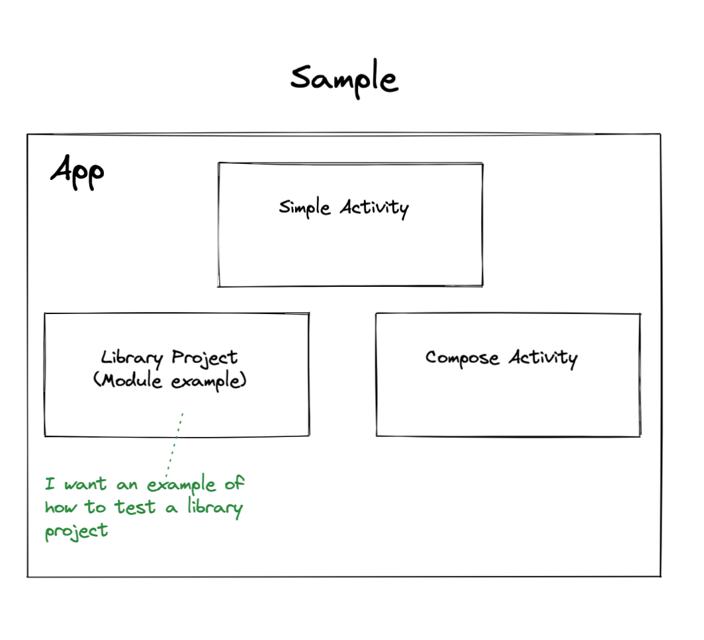

# Sample Application

A comprehensive sample application exists to provide detailed examples of how to use every Testify API. The sample should demonstrate the usage of all public methods and all extension libraries.

For Testify 2.0, this means we will need to enhance the sample to include:

- An library module dependency
- Image loading libraries Picasso, Glide and Coil
- One injection system (Dagger, Koin or Hilt)
- JUnit5 tests
- ActivityScenario tests

