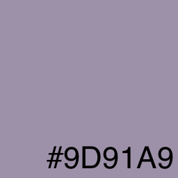
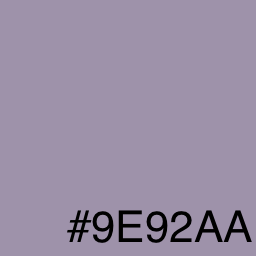

export const Swatch = ({children, color}) => (
  <span
    style={{
      backgroundColor: color,
      borderRadius: '2px',
      color: '#fff',
      padding: '0.2rem'
    }}>
    {children}
  </span>
);

A common problem when using Testify is having to deal with undesirable differences in your screenshots caused by variations in platforms or hardware. This blog will explain how to configure Testify to account for these differences.

<!--truncate-->

---

Much of the UI in Android is rendered with hardware acceleration. This means that both the GPU and CPU used by your test device will impact the rendering of your screenshots. Commonly, this is caused by subtle differences in floating point rounding.

The elements most frequently impacted by hardware accelerated rendering are:

1. [Shadows & elevation](https://m1.material.io/material-design/elevation-shadows.html)
2. [Font smoothing & anti-aliasing](https://medium.com/@ali.muzaffar/android-why-your-canvas-shapes-arent-smooth-aa2a3f450eb5)
3. [Image decompression and rendering](https://en.wikipedia.org/wiki/Compression_artifact)
4. [Alpha blending, or alpha compositing](https://en.wikipedia.org/wiki/Alpha_compositing)

## Background

Let’s walk through a brief example that explains how these small hardware differences can impact your captured screenshots.

In this example, our UI uses two ARGB colors which each have some transparency. These colors are defined as **ARGB(128,189,85,85)**<Swatch color="#deaaaa">&nbsp;&nbsp;&nbsp;&nbsp;</Swatch> and **ARGB(128,0,161,254)**<Swatch color="#7fd0fe">&nbsp;&nbsp;&nbsp;&nbsp;</Swatch>.

In hardware, those would be represented as floating point numbers: **(0.502f,&nbsp;0.741f,&nbsp;0.333f,&nbsp;0.333f)** and **(0.502f,&nbsp;0f,&nbsp;0.631f,&nbsp;0.996f)** respectively.

If we stack these two swatches on top of a pure white background, the GPU will composite the two colors together in such a way that they appear like the following opaque color in the UI: <br/>
**(1.0f,&nbsp;0.619f,&nbsp;0.572f,&nbsp;0.666f)**<Swatch color="#9a92aa">&nbsp;&nbsp;&nbsp;&nbsp;</Swatch>.

When capturing a screenshot, the onscreen image is saved to a bitmap file. Testify uses PNG files to store these images. During the capture process, the pixels are translated from the hardware representation to an integer representation by multiplying the floating point value by 255. Depending on many factors, the exact transformation that takes place can result in minor variations of the same values.


- `0.619f × 255` might be rounded to 158 or truncated to 157
- `0.572f × 255` might be rounded to 146 or truncated to 145
- `0.666f x 255` might be rounded to 170 or truncated to 169

This is generally regarded as a harmless or insignificant since the difference in the resulting colors will be imperceptible to the human eye.

 or 

Yes these are different!

This technique of blending two colors together is common in Android UI and so is a cause of many unintentional differences in your screenshot tests.

If you look at the hex representation of these two colors you can see that, mathematically speaking, these numbers are quite different from one another:

`0x9D91A9` vs. `0x9E92AA`

This can cause significant problems for screenshot tests.

A bit-based comparison will immediately fail due to the numbers not being identical.
Even a tolerance-based comparison will likely fail as the difference between the two numbers is `0x10101`, or 65,793!


## A common problem

These types of hardware rounding differences are very common. A variety of configuration options can impact the captured Testify images. The CPU (M1 or x86), the GPU (discrete or integrated), emulator image (arm64, x86 or x86_64) and emulated performance settings (number of CPU cores, emulated Graphics – Hardware or Software GLES 1.1 or GLES 2.0) will all impact the mathematical calculations that take part of the rendering and capture of any bitmaps by Testify.

In an ideal world, you would ensure that all devices in your testing environment are configured to use identical hardware and software settings. This would be the easiest way to avoid minor baseline image differences due to hardware variations.

However, it is extremely common for teams to have a variety of hardware configurations in use and it can be impossible to standardize on any one specific configration. Many large teams employ a large variety of development hardware, and the hardware configuration of many Continuous Integration Services offer limited or no control over their hardware.

In fact, this is so common that Testify has built-in accomodations for such differences.

## Capture screenshots at the highest quality

Before we can deal with these rendering irregularities, we need to first ensure we're capturing high-quality data. We need to set up the screenshot tests to capture the highest-quality screenshots possible.

### Enable PixelCopyCapture

[`PixelCopy`](https://developer.android.com/reference/android/view/PixelCopy) is a method provided by the Android SDK since API 24 which will faithfully capture the entire `Surface` presented in the UI to a `Bitmap`. This includes elevation, shadows and other GPU-accelerated rendering features.

For best results, it is recommended that you enable the `PixelCopyCapture` method in Testify.

There are three ways you can enable `PixelCopyCapture`:

#### In your project manifest. 

You can enable `PixelCopyCapture` in your `AndroidManifest.xml`. This way, this capture method will be used for all tests in your entire project.

```xml
<manifest package="dev.testify.sample"
  xmlns:android="http://schemas.android.com/apk/res/android">
  <application>
    <meta-data android:name="testify-pixelcopy-capture" android:value="true" />
  </application>
</manifest>
```
#### In your test class

You can enable `PixelCopyCapture` for your test class by enabling the `PixelCopyCapture` feature flag in a `@Before` block. With this method, you will enable the `PixelCopyCapture` for every test method in your class.

```kotlin
@Before
fun before() {
  TestifyFeatures.PixelCopyCapture.setEnabled(true)
}
```

#### On your test rule

You can enable `PixelCopyCapture` on a case-by-case basis with the `withExperimentalFeatureEnabled()` modifier on `ScreenshotTestRule`.

```kotlin
@get:Rule val rule = ScreenshotRule(MainActivity::class.java)

@ScreenshotInstrumentation
@Test
fun testDefault() {
  rule
    .withExperimentalFeatureEnabled(TestifyFeatures.PixelCopyCapture)
    .assertSame()
}
```

## Ignore unimportant differences


In order to account for the large integer differences that can exist between two visually similar pixels, we need to employ some kind of smart tolerance or heuristic to intelligently exclude irrelevant differences yet still fail on meaningful changes to the UI.

Even though the number variance may be large, the human eye may not be able to perceive the difference in color. Thankfully, there are multiple algorithms that can tell us the distinction between an unimportant or important changes.

> _In color science, **color difference** or **color distance** is the separation between two colors. This metric allows quantified examination of a notion that formerly could only be described with adjectives._
> https://en.wikipedia.org/wiki/Color_difference#CIELAB_%CE%94E*

One such color distance algorithm is _Delta E_.

The Delta E algorithm can mathematically quantify the similarity between two different colors. It allows us to ignore the differences between two pixels that the human eye would consider identical while still identifying differences in position, size or layout. Uing Delta E when comparing two images provides a reasonable allowance for small differences in the rendered result that most of us would consider as being “the same”.

Testify has an optional implementation of the Delta E color distance algorithm which can be enabled with the `setExactness()` modifier.

### Enable Delta E comparison with an exactness value of less than 1

You can enable the Delta E comparison method on the Testify rule using the [`setExactness()`](http://localhost:3000/android-testify/docs/recipes/tolerance) method.

Any value less than `1.0f` will enable the Delta E comparison method. 

A value of `0.0f` will instruct the comparison method to ignore all differences, no matter how significant. A value of between `0.7f` and `0.9f` will generally be the "sweet spot" that will ignore the majority of minor rendering variations while still failing on significant layout changes. You can experiment with your tests to find which value is best for your environment. I'd recommend starting with `0.9f` and reducing the value in increments of `0.05f` until all of your tests pass.

:bookmark: The Delta E comparison implementation uses a coroutine worker pool to efficiently parallelize the comparison operation. As such, it is highly recommend that you enable Multi-Core CPU features on your test target emulator.

#### Before each test

You can enable the Delta E comparison for all tests in a test class by enabling it on the `ScreenshotRule` in a `@Before` method.

```kotlin
@get:Rule val rule = ScreenshotRule(MainActivity::class.java)

@Before
fun before() {
  rule.setExactness(0.8f)
}
```

#### For one test case

You can enable the Delta E comparison for a single test by enabling it on the `ScreenshotRule` in the body of the test method, prior to invoking `assertSame()`.

```kotlin
@get:Rule val rule = ScreenshotRule(MainActivity::class.java)

@ScreenshotInstrumentation
@Test
fun testDefault() {
  rule
    .setExactness(0.8f)
    .assertSame()
}
```

## Conclusion

A test failure should provide you with important, actionable information. Unimportant rendering differences should not cause your tests to fail. By using `PixelCopyCapture` with a tolerance of around `0.9f`, you can safely ignore unimportant differences in your screenshots caused by variations on your testing hardware. This allows you to work more efficiently with others and focus on the visual quality of your application.
