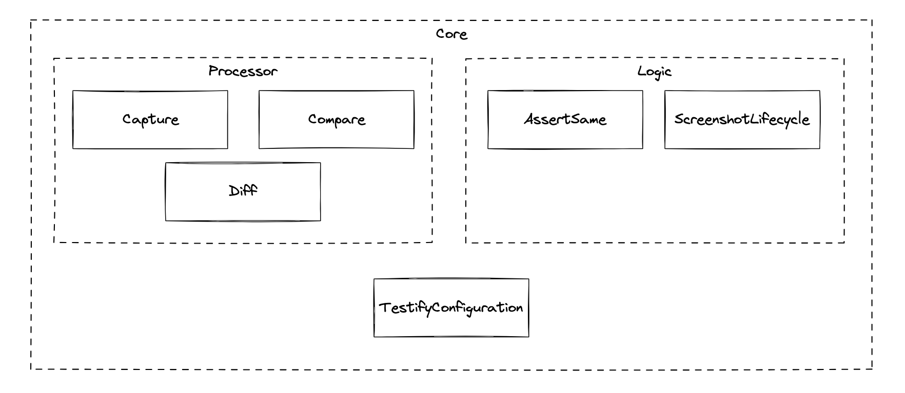

# Testify 2.0: A New Era of Android Screenshot Testing

We're thrilled to announce the stable release of Testify 2.0, a significant leap forward in Android Screenshot Testing! 🎉 Testify empowers developers to enhance test coverage by including the UI layer in their testing, providing a robust tool for monitoring UI quality and detecting unintended changes in view rendering.

With Testify 2.0, effortlessly set up a variety of screenshot tests in your application, offering a new perspective for monitoring UI experiences and reviewing changes. This release marks a milestone, delivering a testing solution that seamlessly adapts to your needs, ensuring a dependable and feature-rich experience for Android developers. Establishing a comprehensive set of screenshot tests for your application has never been easier.

## Key Goals of the Testify 2.0 Architecture

### Core Functionality Separation

Testify 2.0 focuses on providing a highly customizable and configurable core library with pre-built solutions for common testing scenarios. The new architecture separates the core screenshot functionality from the JUnit4 lifecycle and AndroidTestRule, opening up new possibilities for expansion, customization, and adaptation to multiple testing requirements.

The core library in Testify 2.0 is designed to support classic Android Views, Compose UI, and Surface Views. It is highly modular, offering a scalable, programmable, and extensible API set to cover a wide range of testing scenarios. The primary goal of the 2.0 architecture was to separate Testify into extensible and reusable components, allowing unparalleled customization to meet all of your testing needs. For example, the new `TestifyConfiguration` class allows you to easily configure and customize your screenshot tests to handle a multitude of UI setups.

The new `CaptureMethod` and `CompareMethod` interfaces allow you to write and plug-in any custom screenshot capture or comparison logic you desire.

Many internal and helper functions are now available as public methods, allowing you to leverage Testify in new and original ways.

### Plugins & Extensions

A key feature of the Testify 2.0 architecture is its use of Plugins and Extensions.

**Plugins** provide improvements to, and integrations with, common client-side development tools. Their goal is to improve developer productivity and happiness. The _**Gradle Plugin**_ offers tasks for recording baseline images, running tests, viewing diagnostics, and generating reports, while the _**IntelliJ Platform Plugin**_ provides GUI integration directly into Android Studio for accessing common actions.

**Extensions** offer developers the opportunity to expand upon the existing Testify patterns by easily slotting in new functionality. Provided Testify Extensions allow for testing accessibility, composables from Jetpack Compose, or capturing the whole screen. These extensions can be used to improve the quality of your tests or perform advanced testing scenarios. Or, you may now easily provide your own extensions to further customize Testify.

For example, the _**Fullscreen Capture Method**_ allows you to capture the entire device screen, including system UI, dialogs, and menus.

The _**Accessibility Checks**_ extension allows you to combine visual regression testing with accessibility checks to further improve the quality and expand the reach of your application.

### Sample Application Enhancements

Testify 2.0 introduces additional, expressive sample codes to help get you started on with screenshot testing. You can now find examples showcasing Testify being used with **Jetpack Compose**, **Gradle Managed Devices**, **Dependency Injection**, and **Android Clean Architecture**.

The comprehensive set of sample applications demonstrate the usage of all public methods and extension libraries as well as providing examples of commonly tested scenarios.

## How to Get Started

To explore the new features and improvements in Testify 2.0.0, follow our [documentation](https://ndtp.github.io/android-testify/docs/intro) for installation instructions and usage guidelines.

To learn how to tackle more advanced testing scenarios, check out our [Recipe Book](http://localhost:3000/android-testify/docs/category/recipes).

We encourage developers to provide feedback, report issues, and contribute to the Testify community on [GitHub](https://github.com/ndtp/android-testify/). Your insights help us make Testify even better!

Thank you for being a part of the Testify journey. Embrace the future of Android Screenshot Testing with Testify 2.0!

Happy testing! 📸

---

#### Changelog

For a detailed list of changes and enhancements in Testify 2.0.0, check out the [changelog](https://github.com/ndtp/android-testify/blob/main/CHANGELOG.md).
